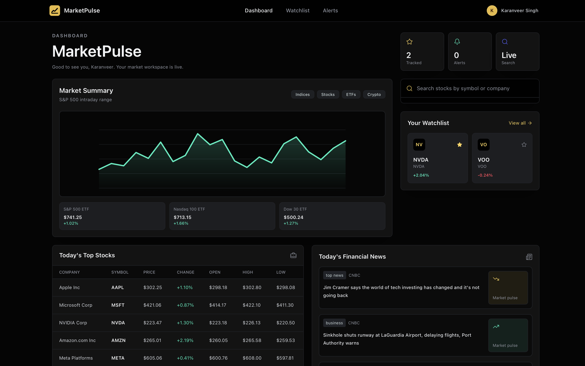
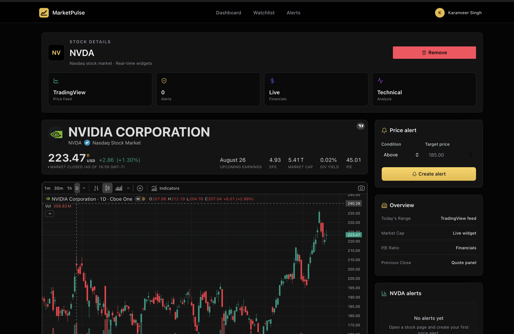
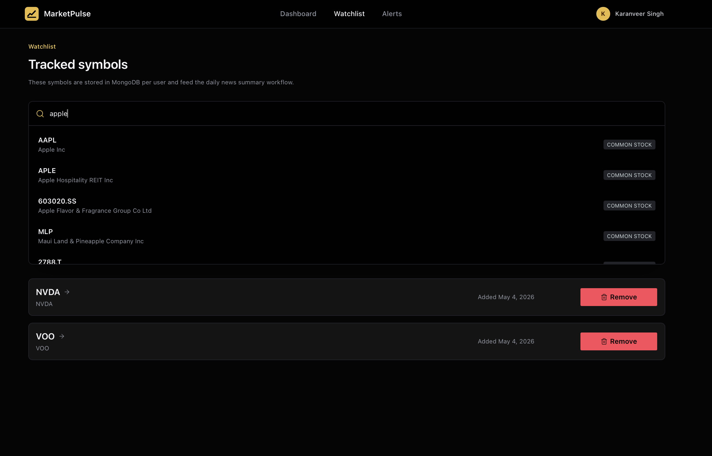
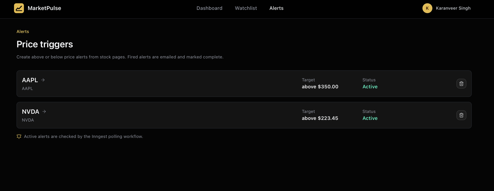

# MarketPulse

MarketPulse is a full-stack stock-market dashboard built with Next.js, Better Auth, MongoDB, Finnhub, TradingView widgets, Inngest, Gemini, and Nodemailer. It supports authenticated user accounts, stock search, TradingView-powered stock detail pages, persistent watchlists, investment tracking, price alerts, AI-generated welcome emails, and scheduled market briefing emails.

## Features

- Email/password authentication with first name and last name capture
- Protected dashboard, watchlist, investments, alerts, and stock detail pages
- Finnhub-powered stock search with debounced results and symbol/name suggestions
- Live dashboard quotes for major stocks and ETF market proxies
- TradingView widgets for symbol info, charts, technical analysis, company profile, and financials
- MongoDB-backed watchlist per user
- MongoDB-backed investment tracker with live quote-based share calculation and profit/loss views
- MongoDB-backed price alerts with above/below target triggers
- Inngest background workflows for signup emails, daily market summaries, and alert polling
- Gemini-generated welcome copy and market summaries with safe fallbacks
- Nodemailer email delivery with local preview logging
- Server action/API rate limiting, input validation, and security headers

## Screenshots

### Dashboard



### Stock Details



### Watchlist



### Investments

Track real brokerage positions by selecting a stock, entering money spent, and letting MarketPulse calculate estimated shares from the latest Finnhub quote.

### Price Alerts



## Tech Stack

- **Framework:** Next.js 16, React 19, TypeScript
- **Styling/UI:** Tailwind CSS, shadcn-style components, Radix UI, lucide-react
- **Auth:** Better Auth
- **Database:** MongoDB Atlas, Mongoose, MongoDB driver
- **Market Data:** Finnhub API
- **Charts:** TradingView external widgets
- **Automation:** Inngest
- **AI:** Gemini via `@google/genai`
- **Email:** Nodemailer

## Architecture

```text
User
  |
  +--> Better Auth ----> MongoDB users/sessions
  |
  +--> Dashboard/Search ----> Server Actions ----> Finnhub
  |
  +--> Watchlist/Investments/Alerts ----> Server Actions ----> MongoDB
  |
  +--> Investment Quote Preview ----> Server Actions ----> Finnhub live quote
  |
  +--> Stock Page ----> TradingView Widgets
  |
  +--> Inngest Workflows
          |
          +--> Gemini summaries
          +--> Nodemailer emails
          +--> MongoDB user/watchlist/alert reads
          +--> Finnhub news/quote reads
```

## Getting Started

Install dependencies:

```bash
npm install
```

Create an environment file:

```bash
cp .env.example .env
```

Fill in the required values, then run:

```bash
npm run dev
```

Open [http://localhost:3000](http://localhost:3000).

## Environment Variables

Required for core local development:

```env
MONGODB_URI=
BETTER_AUTH_SECRET=
BETTER_AUTH_URL=http://localhost:3000
NEXT_PUBLIC_APP_URL=http://localhost:3000
FINNHUB_API_KEY=
UPSTASH_REDIS_REST_URL=
UPSTASH_REDIS_REST_TOKEN=
GEMINI_API_KEY=
EMAIL_MODE=preview
INNGEST_DEV=1
```

Optional for real email delivery:

```env
SMTP_HOST=
SMTP_PORT=587
SMTP_USER=
SMTP_PASS=
EMAIL_FROM=
```

Optional for deployed Inngest:

```env
INNGEST_EVENT_KEY=
INNGEST_SIGNING_KEY=
```

Generate a Better Auth secret:

```bash
openssl rand -base64 32
```

## Scripts

```bash
npm run dev      # Start local development server
npm run build    # Production build
npm run start    # Start production server
npm run lint     # Run ESLint
```

## Background Jobs

MarketPulse defines three Inngest workflows:

- `send-sign-up-email`: runs after account creation and sends a Gemini-personalized welcome email
- `daily-news-summary`: runs daily at 12:00 and emails market summaries based on each user's watchlist
- `check-price-alerts`: runs every 15 minutes, checks active alerts against Finnhub quotes, emails triggered alerts, and marks them as fired

For local development, `EMAIL_MODE=preview` logs emails instead of sending them. If the Inngest dev server is not running locally, signup still succeeds and logs a preview event.

## Security Notes

- `.env`, `.env.local`, and other env files are ignored by Git
- `node_modules` and `.next` are ignored by Git
- Server actions verify the authenticated user before watchlist, investment, and alert mutations
- Watchlist, investment, and alert mutations are scoped by `userId`
- Stock symbols, investment amounts, dates, and alert prices are validated server-side
- Search, quote, watchlist, investment, alert, API, and auth routes use Upstash Redis rate limiting when configured, with local in-memory fallback for development
- Security headers and API/auth throttling are configured in `proxy.ts`

For production, configure `UPSTASH_REDIS_REST_URL` and `UPSTASH_REDIS_REST_TOKEN`, configure MongoDB Atlas network access carefully, use a strong `BETTER_AUTH_SECRET`, and enable real Inngest signing keys. For real DDoS protection, deploy behind a platform/CDN layer such as Vercel, Cloudflare, or another provider with edge-level traffic filtering.

## Git Hygiene

Commit source files, `package.json`, `package-lock.json`, and `.env.example`.

Do not commit:

- `.env`
- `.env.local`
- `node_modules`
- `.next`
- API keys, database passwords, SMTP credentials, or auth secrets

The current `.gitignore` already excludes these files.

## Status

Implemented:

- Auth
- Dashboard
- Stock search
- Stock detail pages
- Watchlist
- Investments
- Alerts
- Email templates
- Inngest workflows
- Gemini summaries
- Basic security hardening
- Durable production rate limiting with Upstash Redis REST

Planned improvements:

- Replace in-memory rate limiting with durable rate limiting
- Add richer historical dashboard chart data
- Add alert frequency controls
- Add profile/settings page
